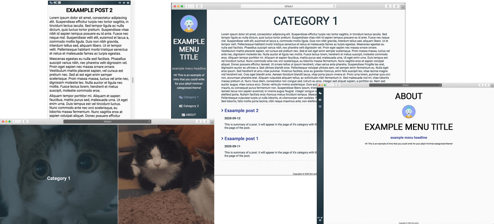

<h1><a href="https://github.com/ItsMeaga1n/minimal-categorized/"> minimal-categorized Jekyll theme </h1></a>

[](https://raw.githubusercontent.com/mmistakes/minimal-mistakes/master/LICENSE)
[](https://jekyllrb.com/)
[](https://badge.fury.io/rb/minimal-categorized)
<a href="https://ko-fi.com/itsmeaga1n">
  
</a>
<a href="https://jekyll-themes.com">
    
</a>

minimal-categorized is a flexible Jekyll theme, designed for sites with content easily aggregated into two categories. It's main focus is on separating two main categories, while maintaining minimal style and full customization. Demo is available [here](https://itsmeaga1n.github.io/minimal-categorized/).



## Installation
There are three ways to install:

* As a ruby gem theme:

    Add this line to your Jekyll site's `Gemfile`:

    ```ruby
    gem "minimal-categorized"
    ```

    And add this line to your Jekyll site's `_config.yml`:

    ```yaml
    theme: minimal-categorized
    ```

    And then execute:

        $ bundle

    Or install it yourself as:

        $ gem install minimal-categorized

* As a remote theme (GitHub Pages compatible)
    
    In your Jekyll site's _config.yml remove other themes and add this entry:
    ```
    remote_theme: ItsMeaga1n/minimal-categorized
    ```

* Forking/directly copying all of the theme files into your project.
## Usage

This theme is based on separating content into categories, which is later shown on separated sites designated to the specific content type.

As for now, theme allows to use two main categories that will be displayed on home screen and more categories displayed only in menu to further separate content. Those are defined in `_data/menu.yml`.

Structure of `_data/menu.yml`:
* menu_title: Displayed on menu (only for normal menu)
* menu_headline: Displayed in menu (only for normal menu) and in about page
* menu_intro: Displayed in menu (only for normal menu) and in about page
* show_menu_on_gate_page: Boolean value determining if menu should be visible on category selection page
* minimal_menu: Boolean value determining the style of menu bar
* menu_logo: Path to logo displayed on menu (only for normal menu)
* menu_pages: a list of items in menu. Each item contains information:
    * title: Menu position title
    * url: URL for href
    * show_on_home: Boolean value to determine if this position is a category to be shown on category picker
    * image_url: image URL for category picker
    * icon_name: FavIcon to be displayed in menu
    * category: unique identifier of category. Used to determine which menu item is selected
    * tooltip: Tooltip for menu item
* menu_contacts: a list of items to be displayed for a contact section in menu
    * faicon: FavIcon to be displayed in menu
    * url: URL for href
    * target: target value of \<a> tag


Structure of `_data/metaData.yml`:
* author: Site Author name
* avatar_url: URL for avatar (for about page)
* lightTheme: Will work in future releases
* cookies: customize information about site cookies
    * enabled: determine if should show cookies pop-up
    * message: text on cookie pop-up
    * agreeButtonText: text on agree button
* show_menu_logo_on_home_page: boolean value determining, if should display logo from "menu_logo" entry in default home page layout
## Contributing

Bug reports and pull requests are welcome on [GitHub](https://github.com/ItsMeaga1n/minimal-categorized). This project is intended to be a safe, welcoming space for collaboration, and contributors are expected to adhere to the [Contributor Covenant](http://contributor-covenant.org) code of conduct.

## Development

To set up your environment to develop this theme, run `bundle install`.

Your theme is setup just like a normal Jekyll site! To test your theme, run `bundle exec jekyll serve` and open your browser at `http://localhost:4000`. This starts a Jekyll server using your theme. Add pages, documents, data, etc. like normal to test your theme's contents. As you make modifications to your theme and to your content, your site will regenerate and you should see the changes in the browser after a refresh, just like normal.

When your theme is released, only the files in `_layouts`, `_includes`, `_sass` and `assets` tracked with Git will be bundled.
To add a custom directory to your theme-gem, please edit the regexp in `minimal-categorized.gemspec` accordingly.

## License

The theme is available as open source under the terms of the [MIT License](https://opensource.org/licenses/MIT).
